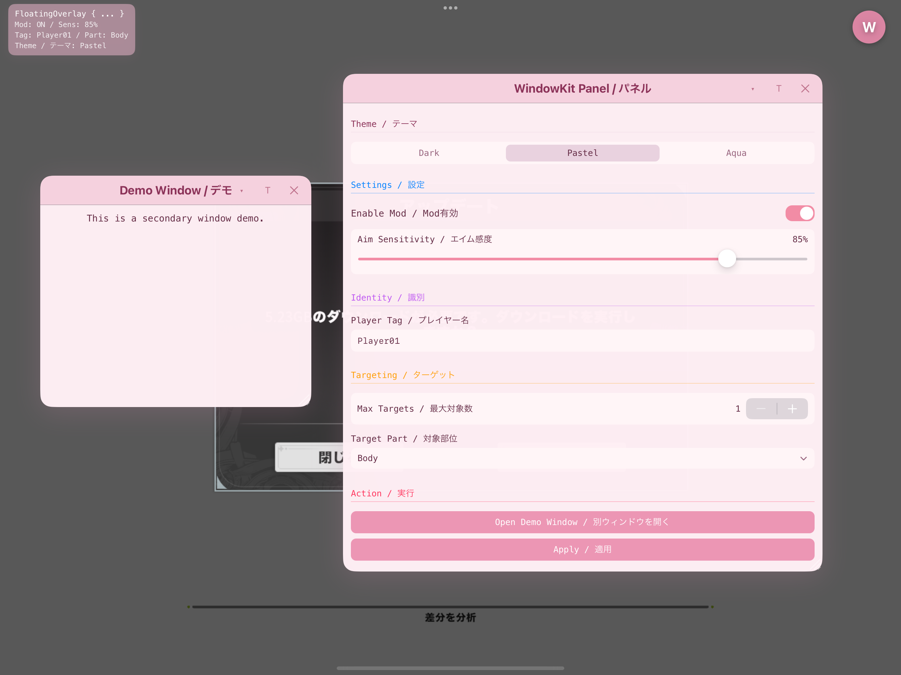
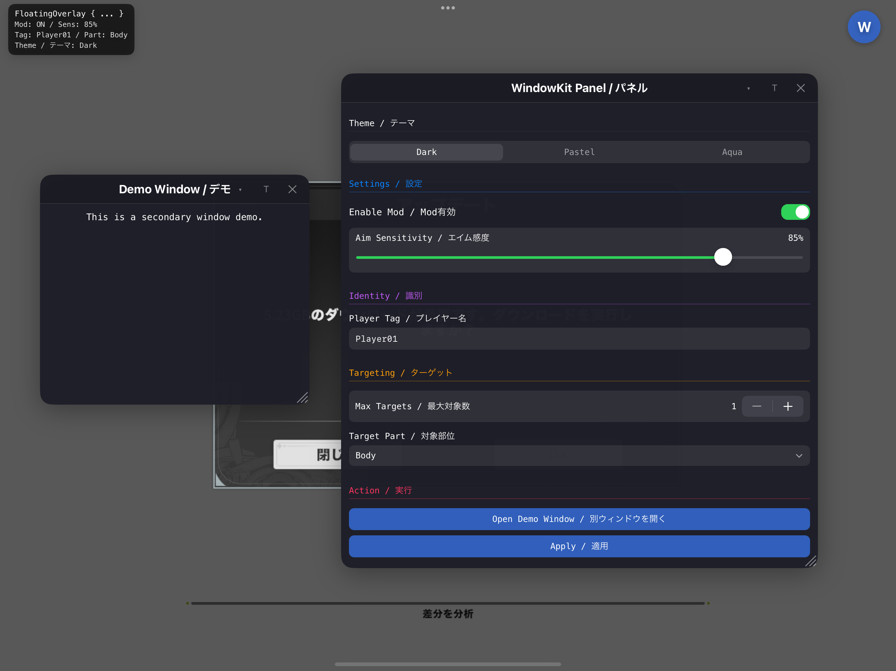
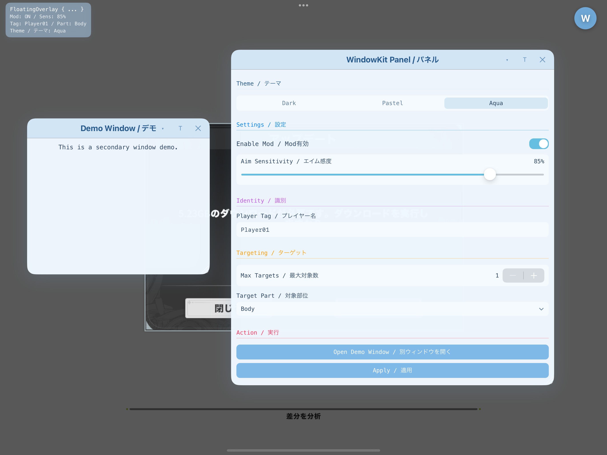

# SwiftUI Mod Menu

English README: `README_EN.md`

iOSアプリ上に SwiftUI ベースのフローティングUIを重ねて表示するためのテンプレートです。  
利用には **Jailbreak 環境** または **LiveContainer** が必要です。  
ドラッグ可能なボタン・ウィンドウ・オーバーレイと、設定画面向けのコンポーネントを提供します。

---

## スクリーンショット





---

## 特徴

- フローティングUI (`WKFloatingButton`, `WKFloatingWindow`, `WKFloatingOverlay`)
- 3テーマ切替 (`Dark`, `Pink`, `Aqua`)
- 設定永続化（`WKSettingsStore` + 各コントロールの `persist`）
- 位置/サイズ永続化（`persistKey` + `WKPersistence`）
- SwiftUI + Theos 構成

---

## クイックスタート

```swift
import SwiftUI

struct Main: View {
    @State private var showWindow = true
    @State private var speedMode = "Normal"

    var body: some View {
        WKRoot(fontName: "Menlo-Regular") {
            WKFloatingButton(persistKey: "btn_pos", onTap: { showWindow.toggle() }) {
                Circle().fill(.blue).overlay(Text("W").foregroundColor(.white))
            }

            if showWindow {
                WKFloatingWindow(
                    title: "WindowKit",
                    isPresented: $showWindow,
                    persistKey: "main_window"
                ) {
                    VStack(alignment: .leading, spacing: 8) {
                        WKSectionHeader(title: "Mode")
                        WKSegmentPicker(
                            items: ["Low", "Normal", "High"],
                            selection: $speedMode,
                            persist: true,
                            persistKey: "speed_mode"
                        )
                    }
                    .padding(12)
                }
            }
        }
    }
}
```

---

## コンポーネント一覧（全パーツ）

### ルート / テーマ

- `WKRoot` (`WKStack` は同義alias)
  - `init(theme: Binding<WKTheme>? = nil, initialTheme: WKTheme = .dark, fontName: String? = nil, content: () -> Content)`
  - `init(theme: Binding<WKTheme>? = nil, initialTheme: WKTheme = .dark, fontName: String? = nil, content: (WKTheme) -> Content)`
  - `theme`: 外部からテーマ制御したい場合に使用
  - `initialTheme`: 外部Bindingがない場合の初期テーマ
  - `fontName`: `WKText` へ注入するフォント名

- `WKTheme`
  - `dark`, `pink`, `aqua`
  - `label`, `palette` を提供

- `WKThemePalette`
  - ウィンドウ/タイトル/テキスト/トグル/入力背景などの色セット

### フローティングUI

- `WKFloatingButton`
  - `init(size: CGFloat = 50, persistKey: String? = nil, defaultPosition: CGPoint? = nil, onTap: @escaping () -> Void, label: () -> Label)`
  - `size`: タップ領域サイズ
  - `persistKey`: 位置保存キー
  - `defaultPosition`: 保存がない場合の初期位置
  - `onTap`: タップ時処理

- `WKFloatingWindow`
  - `init(title: String, isPresented: Binding<Bool>, persistKey: String? = nil, minSize: CGSize = (200,200), defaultSize: CGSize = (400,400), style: FloatingWindowStyle? = nil, actions: () -> Actions, content: () -> Content)`
  - `init(title: String, isPresented: Binding<Bool>, persistKey: String? = nil, minSize: CGSize = (200,200), defaultSize: CGSize = (400,400), style: FloatingWindowStyle? = nil, content: () -> Content)`（actions省略版）
  - `title`: タイトルバー表示文字
  - `isPresented`: 表示/非表示制御
  - `persistKey`: 位置・サイズ保存キー
  - `minSize`, `defaultSize`: 最小/初期サイズ
  - `style`: `FloatingWindowStyle` で見た目差し替え
  - `actions`: タイトルバー右側の追加ボタン群

- `WKFloatingOverlay`
  - `init(persistKey: String? = nil, defaultPosition: CGPoint = CGPoint(x: 120, y: 120), content: () -> Content)`
  - `persistKey`: 位置保存キー
  - `defaultPosition`: 初期位置

### テキスト/設定コントロール

- `WKText`
  - `init(_ content: String, tone: WKTextTone = .primary, color: Color? = nil, fontName: String? = nil, size: CGFloat = 14, weight: Font.Weight = .regular, design: Font.Design = .default)`
  - `tone`: `.primary / .secondary / .title`

- `WKSectionHeader`
  - `init(title: String, color: Color? = nil)`

- `WKToggleRow`
  - `init(label: String, isOn: Binding<Bool>, persist: Bool = false, persistKey: String? = nil, onChanged: ((Bool) -> Void)? = nil)`

- `WKSegmentPicker`（3パターン）
  - `init(items: [String], selection: Binding<String>, persist: Bool = false, persistKey: String? = nil)`
  - `init(items: [String], persist: Bool = false, persistKey: String? = nil)`（テーマ選択用途）
  - `init(items: [String], selection: Binding<WKTheme>, persist: Bool = false, persistKey: String? = nil)`

- `WKSliderRow`
  - `init(label: String, value: Binding<Double>, in range: ClosedRange<Double>, step: Double = 1, formatter: ((Double) -> String)? = nil)`

- `WKTextFieldRow`
  - `init(label: String, placeholder: String, text: Binding<String>)`

- `WKStepperRow`
  - `init(label: String, value: Binding<Int>, in range: ClosedRange<Int>)`

- `WKMenuPickerRow`
  - `init(label: String, options: [String], selection: Binding<String>)`

- `WKActionButton`
  - `init(title: String, action: @escaping () -> Void)`

### 永続化

- `WKSettingsStore`（コントロール値）
  - `saveBool(_:forKey:)`, `loadBool(forKey:default:)`
  - `saveString(_:forKey:)`, `loadString(forKey:default:)`
  - 保存先: `Documents/wk_settings.plist`

- `WKPersistence`（位置/サイズ）
  - `savePoint(_:forKey:)`, `loadPoint(forKey:)`
  - `saveSize(_:forKey:)`, `loadSize(forKey:)`
  - 保存先: `Documents/wk_<key>.plist`

---

## フルサンプル（主要パーツ使用）

```swift
import SwiftUI

struct Main: View {
    @State private var showMain = true
    @State private var showDemo = false

    @State private var modEnabled = true
    @State private var sensitivity = 0.55
    @State private var profile = "Balanced"
    @State private var playerTag = "Player01"
    @State private var maxTargets = 3
    @State private var targetPart = "Body"

    var body: some View {
        WKRoot(fontName: "Menlo-Regular") { theme in
            WKFloatingButton(persistKey: "btn_pos", onTap: { showMain.toggle() }) {
                Circle().fill(theme.palette.settingsButtonFill)
                    .overlay(Text("W").foregroundColor(.white))
            }

            if showMain {
                WKFloatingWindow(
                    title: "WindowKit Panel",
                    isPresented: $showMain,
                    persistKey: "panel_window",
                    minSize: CGSize(width: 300, height: 320),
                    defaultSize: CGSize(width: 360, height: 520)
                ) {
                    ScrollView(showsIndicators: false) {
                        VStack(alignment: .leading, spacing: 8) {
                            WKSectionHeader(title: "Theme")
                            WKSegmentPicker(items: WKTheme.allCases.map { $0.label }, persist: true, persistKey: "wk_theme")

                            WKSectionHeader(title: "Settings", color: .blue)
                            WKToggleRow(label: "Enable Mod", isOn: $modEnabled, persist: true, persistKey: "toggle_mod_enabled")
                            WKSegmentPicker(items: ["Safe", "Balanced", "Aggressive"], selection: $profile, persist: true, persistKey: "profile_mode")
                            WKSliderRow(label: "Aim Sensitivity", value: $sensitivity, in: 0.10...1.00, step: 0.05) { "\(Int(($0 * 100).rounded()))%" }

                            WKSectionHeader(title: "Identity", color: .purple)
                            WKTextFieldRow(label: "Player Tag", placeholder: "Player01", text: $playerTag)

                            WKSectionHeader(title: "Targeting", color: .orange)
                            WKStepperRow(label: "Max Targets", value: $maxTargets, in: 1...10)
                            WKMenuPickerRow(label: "Target Part", options: ["Body", "Head", "Nearest"], selection: $targetPart)

                            WKSectionHeader(title: "Action", color: .pink)
                            WKActionButton(title: "Open Demo Window") { showDemo = true }
                        }
                        .padding(.horizontal, 12)
                        .padding(.vertical, 10)
                    }
                }
            }

            if showDemo {
                WKFloatingWindow(title: "Demo", isPresented: $showDemo, persistKey: "demo_window") {
                    WKText("This is a secondary window demo.", tone: .primary, size: 14)
                        .padding(12)
                }
            }

            WKFloatingOverlay(persistKey: "info_overlay", defaultPosition: CGPoint(x: 120, y: 70)) {
                VStack(alignment: .leading, spacing: 3) {
                    WKText("FloatingOverlay { ... }", color: .white, size: 12, weight: .semibold, design: .monospaced)
                    WKText("Theme: \(theme.label)", color: .white.opacity(0.85), size: 11, design: .monospaced)
                }
            }
        }
    }
}
```

---

## Swift <-> C 連携

- Swift -> C
  - `SwiftUI_Mod_Menu-Bridging-Header.h` に C関数を宣言
  - 例: `void SwiftToC(int value);`
- C/ObjC -> Swift
  - 必要に応じて `@_cdecl("SymbolName")` を使用
  - もしくは `Loader.setup()` のように ObjC公開クラス経由で呼び出し

---

## ビルド

```bash
make clean && make package
```

`make package` 後、Makefile の `after-package` で `.deb` から `.dylib` を自動抽出します。

---

## クレジット

- Dobby: jmpews (`Apache-2.0`)
  - https://github.com/jmpews/Dobby

- HuyJIT-ModMenu: Huy Nguyen (34306) (`MIT`)
  - https://github.com/34306/HuyJIT-ModMenu

---

## Contributing

貢献は大歓迎です。  
Issue / Pull Request / 改善提案、どれでも気軽に送ってください。

